# 2 号接手操作说明填空版

本文档用于把 1 号的“选平台、注册账号、摸清问卷”结果交给 2 号。你可以把方括号中的内容补齐后，直接发给 2 号作为批量采集前的操作说明。

不要在本文档中填写密码、Cookie、登录令牌、恢复邮箱验证码等敏感信息。如果仓库保持 public，开发者账号 ID、应用 ID、真实邮箱也建议只在组内私聊或私有文档中保存。

## 1. 平台选择

| 项目 | 当前结论 | 需要补充 |
|---|---|---|
| 研究平台 | Google Play Console | 已确定 |
| 问卷入口 | `Policy and programs -> App content -> Content ratings` | [填：当前页面 URL，只在组内私有渠道发] |
| 固定分支 | `Game` 内容评级问卷 | 已确定 |
| 选择理由 | Google Play 的内容评级问卷会在 Summary 页给出多个地区评级，适合作为课程项目的数据采集对象。 | [填：课程 report 中是否需要更正式的理由] |
| 采集目标 | Summary 页中的地区评级、Content descriptors、Interactive elements，以及对应问卷答案路径。 | 已确定 |
| 不做的事 | 不发布应用，不点击最终 `Submit`/送审按钮，不绕过 reCAPTCHA，不自动输入账号密码。 | 已确定 |

给 2 号的一句话版本：

> 本项目固定研究 Google Play Console 的 `Game` 内容评级问卷。2 号只需要在隔离草稿应用里运行脚本读取 Summary，不要操作真实应用，也不要点击最终提交或送审。

## 2. 账号与测试应用台账

以下信息用于让 2 号知道该在哪个环境里继续，不用于保存登录凭据。

| 字段 | 内容 |
|---|---|
| Play Console 账号负责人 | [填：姓名/组内称呼，不要填密码] |
| Google 账号邮箱 | [私有渠道填写；public 仓库建议留空] |
| 开发者账号显示名 | [填：例如控制台右上角或开发者列表中的名称] |
| 隔离测试应用名称 | [填：测试应用名称] |
| 应用状态 | 未发布草稿应用 |
| 应用包名 | [填：如有；public 仓库可留空] |
| 内容评级问卷 URL | [填：只发给 2 号，不建议写进 public repo] |
| 首次创建日期 | [填：YYYY-MM-DD] |
| 当前登录方式 | 手工登录 Chrome 后，通过 `--connect-cdp` 或 Playwright profile 复用登录状态 |
| 浏览器资料目录 | [填：例如 `.local/chrome-cdp-profile`，不要提交目录内容] |
| CDP 端口 | [填：例如 `9223`] |
| 负责人备注 | [填：账号是否需要二次验证、是否只能在本人电脑上运行等] |

注册/准备检查表：

- [ ] 使用自己的 Google/Play Console 账号，不借用无授权账号。
- [ ] 创建单独的未发布草稿应用，不使用真实要上线的应用。
- [ ] 进入 `App content -> Content ratings`，选择类别 `Game`。
- [ ] 手工完成一次全 `No` 路径，确认可以到达 Summary。
- [ ] 截图保存问卷页和 Summary 页。
- [ ] 不点击最终 `Submit`、发布、送审或会影响真实应用状态的按钮。

## 3. 问卷摸清结果

当前问卷地图文件：`questionnaire_map.json`

当前说明文件：`docs/questionnaire_map.md`

截至当前版本，已经记录的问卷节点为：

| 类型 | 数量 | 说明 |
|---|---:|---|
| 顶层问题 | 14 | 全 `No` 路径可见的问题 |
| 条件子问题 | 39 | 父问题满足条件后出现的问题 |
| 当前地图总节点 | 53 | 包括顶层问题和条件子问题 |

按 section 汇总：

| Section | 已记录节点数 | 状态 |
|---|---:|---|
| Violence, Blood, or Gory Images | 18 | 已确认第一层；`humans` 下有更深子题，仍需谨慎 |
| Fear | 5 | `Scary`/`Horrifying` 与 `Rare`/`Often` 探针已完成 |
| Sexuality, Suggestiveness, or Dating Games | 6 | 第一层子题已确认 |
| Gambling Themes, Simulated Gambling, or Real Gambling | 5 | 第一层子题已确认 |
| Language | 5 | 第一层子题已确认 |
| Controlled Substance | 6 | 第一层子题已确认 |
| Crude Humor | 1 | 顶层题已确认，未发现/未继续确认子题 |
| Digital Purchases, Cash Convertible Rewards, or NFTs | 1 | 顶层题已确认，可能影响 interactive elements |
| Miscellaneous | 6 | 六个独立顶层题已确认 |

注意：这里的 `53` 是“当前地图已经记录的节点数”，不是承诺 Google Play 问卷不存在任何更深分支。2 号批量跑 1000 条之前，应先用少量路径验证脚本和 Summary 解析稳定。

## 4. 树状结构速览

```mermaid
flowchart TD
    A["Game 问卷"]
    A --> V["Violence, Blood, or Gory Images"]
    V --> VH["Violence against humans"]
    VH --> VHD["human violence deeper questions"]
    V --> VN["Violence against non-humans"]
    V --> VG["Gory images without violent act"]
    V --> VB["Unrelated blood"]

    A --> F["Fear"]
    F --> FS["Scary elements"]
    FS --> FSR["Rare / Often"]
    F --> FH["Horrifying elements"]
    FH --> FHR["Rare / Often"]

    A --> S["Sexuality / Suggestiveness / Dating"]
    S --> S1["Sexual activity"]
    S --> S2["Suggestive themes"]
    S --> S3["Dating games"]
    S --> S4["Nudity / revealing outfits"]
    S --> S5["Sexual violence refs"]

    A --> G["Gambling"]
    G --> G1["Gambling themes"]
    G --> G2["Playable bingo"]
    G --> G3["Casino / betting"]
    G --> G4["Currency rewards"]

    A --> L["Language"]
    L --> L1["Minor profanities"]
    L --> L2["Moderate swearing"]
    L --> L3["Discriminatory language"]
    L --> L4["Sexual expletives"]

    A --> C["Controlled Substance"]
    C --> C1["Illegal / recreational drugs"]
    C --> C2["Fantasy drugs"]
    C --> C3["Medical drugs"]
    C --> C4["Alcohol"]
    C --> C5["Tobacco"]

    A --> H["Crude Humor"]
    A --> D["Digital Purchases / Rewards / NFTs"]
    A --> M["Miscellaneous 6 independent questions"]
```



完整节点、父条件、选项和证据文件以 `questionnaire_map.json` 为准。

## 5. 2 号开始操作前要先跑的命令

在仓库根目录运行：

```powershell
python -m pip install -r requirements.txt
python -m unittest discover -s .\tests -v
```

先做离线审计，不打开浏览器：

```powershell
python .\fill_once.py `
  --mode audit `
  --answers .\examples\random_001.json `
  --output .\results\random_001.audit.json
```

如果要复用已登录 Chrome，先启动 CDP Chrome：

```powershell
& "$env:ProgramFiles\Google\Chrome\Application\chrome.exe" `
  --remote-debugging-port=[填：端口号，例如 9223] `
  --remote-debugging-address=127.0.0.1 `
  --profile-directory="[填：Chrome profile，例如 Profile 3]"
```

然后用脚本跑单条样本：

```powershell
python .\fill_once.py `
  --mode run `
  --answers .\examples\fear_horrifying_only.json `
  --output .\results\run_check_001.json `
  --connect-cdp http://127.0.0.1:[填：端口号] `
  --allow-unverified-map `
  --confirm-authorized-test-app `
  --allow-save-to-summary
```

跑完后只读取 Summary，不点击最终提交。结果中的 `summary.raw_text` 是最可靠的评级原文。

## 6. 2 号批量采样前的验收空格

| 检查项 | 结果 | 证据文件 |
|---|---|---|
| 全 `No` 路径可到达 Summary | [通过/未通过] | [填：结果 JSON/截图] |
| Fear 已知路径与人工截图一致 | [通过/未通过] | [填：结果 JSON/截图] |
| 至少一条随机路径可稳定读取 Summary | [通过/未通过] | [填：结果 JSON/截图] |
| 隐藏问题输出为 `N/A`，不是 `No` | [通过/未通过] | [填：audit 输出] |
| Summary 多地区评级可解析或可在 `raw_text` 中读取 | [通过/未通过] | [填：结果 JSON] |
| 未出现 reCAPTCHA/限速 | [通过/未通过] | [填：`docs/recaptcha_recon.md` 记录] |
| 脚本未点击最终 `Submit` | [通过/未通过] | [填：截图/操作记录] |

## 7. 交给 2 号的文件

2 号至少需要这些文件：

- `fill_once.py`
- `generate_samples.py`
- `questionnaire_map.json`
- `selectors.json`
- `examples/`
- `docs/member2_operation_template.md`
- `docs/questionnaire_map.md`
- `docs/sampling_strategy.md`
- `docs/sampling_examples.md`
- `docs/recaptcha_recon.md`

2 号不需要这些内容：

- `.local/` 浏览器登录状态
- 账号密码、验证码、Cookie、token
- 真实应用的发布资料
- 最终 `Submit` 或送审权限

## 8. 给 2 号的最短操作原则

1. 先读 `README.md` 和本文档。
2. 先跑测试和 audit，不急着打开浏览器。
3. 用隔离草稿应用，手工确认登录状态。
4. 每次只跑一条样本并看 Summary，确认稳定后再增加数量。
5. 遇到 reCAPTCHA、限速、页面结构变化或 Summary 解析异常，立即停止并记录，不要尝试绕过。
