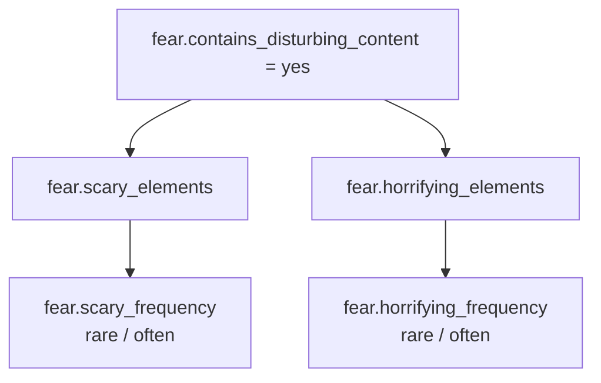

# 探针 1b：Fear = Yes，Horrifying elements

## 目的

验证 `Fear = Yes` 后的 `Horrifying elements` 路径，并比较 `Rare` 与 `Often`
频率对各地区评级的影响。

## 操作设置

日期：2026-06-03  
Rare 结果：`results/run_fear_horrifying_only.json` / `results/run_fear_horrifying_only.png`  
Often 结果：`results/run_fear_horrifying_often.json` / `results/run_fear_horrifying_often.png`

| question_id | Rare 取值 | Often 取值 |
|---|---|---|
| `violence.exists` | no | no |
| `fear.contains_disturbing_content` | yes | yes |
| `fear.scary_elements` | no | no |
| `fear.horrifying_elements` | yes | yes |
| `fear.scary_frequency` | N/A | N/A |
| `fear.horrifying_frequency` | rare | often |
| 其他所有顶层题 | no | no |

## 新增子题

`Horrifying elements = Yes` 后出现频率题：

```json
{
  "question_id": "fear.horrifying_frequency",
  "section": "Fear",
  "prompt": "How frequent are the horrifying elements?",
  "type": "single_choice",
  "options": ["rare", "often"],
  "visible_when": {
    "parent_id": "fear.horrifying_elements",
    "equals": "yes"
  }
}
```

未发现更深层子题。

## Rare Summary 结果

Summary 页概括：

```text
Fear: Pictures or sounds likely to be horrifying (Rarely)
```

| 地区 | Rating authority | Rating | Content descriptors |
|---|---|---|---|
| Australia | Australian Classification Board (ACB) | Mature | Horror Themes |
| Brazil | Classificação Indicativa (ClassInd) | Rated 12+ | Fear |
| North America | Entertainment Software Rating Board (ESRB) | Teen | Mild Violence |
| South Korea | Game Rating and Administration Committee (GRAC) | All ages | Fear |
| Taiwan | Digital Game Self-regulation Committee (DGSC) | Parental Guidance 12 | Horror |
| Saudi Arabia | General Authority of Media Regulation (Gmedia) | 16 | - |
| Europe | Pan-European Game Information (PEGI) | PEGI 12 | Horror |
| Germany | Unterhaltungssoftware Selbstkontrolle (USK) | USK: Ages 12+ | Dark Atmosphere |
| Rest of world | IARC Generic | Rated for 12+ | Horror |
| Russia | Google Play | Rated for 12+ | Horror |

## Often Summary 结果

Summary 页概括：

```text
Fear: Pictures or sounds likely to be horrifying (Often)
```

| 地区 | Rating authority | Rating | Content descriptors |
|---|---|---|---|
| Australia | Australian Classification Board (ACB) | Restricted to 15+ | Strong Horror Themes |
| Brazil | Classificação Indicativa (ClassInd) | Rated 12+ | Fear |
| North America | Entertainment Software Rating Board (ESRB) | Teen | Violence |
| South Korea | Game Rating and Administration Committee (GRAC) | 12+ | Fear |
| Taiwan | Digital Game Self-regulation Committee (DGSC) | Parental Guidance 15 | Horror |
| Saudi Arabia | General Authority of Media Regulation (Gmedia) | 18 | - |
| Europe | Pan-European Game Information (PEGI) | PEGI 12 | Horror |
| Germany | Unterhaltungssoftware Selbstkontrolle (USK) | USK: Ages 16+ | Horror |
| Rest of world | IARC Generic | Rated for 12+ | Horror |
| Russia | Google Play | Rated for 12+ | Horror |

## Rare 与 Often 对比

| 地区 | Rare | Often | 变化 |
|---|---|---|---|
| Australia | Mature | Restricted to 15+ | 升档，描述符更强 |
| Brazil | Rated 12+ | Rated 12+ | 年龄档不变 |
| North America | Teen | Teen | 年龄档不变，描述符变化 |
| South Korea | All ages | 12+ | 升档 |
| Taiwan | Parental Guidance 12 | Parental Guidance 15 | 升档 |
| Saudi Arabia | 16 | 18 | 升档 |
| Europe | PEGI 12 | PEGI 12 | 年龄档不变 |
| Germany | USK: Ages 12+ | USK: Ages 16+ | 升档 |
| Rest of world | Rated for 12+ | Rated for 12+ | 年龄档不变 |
| Russia | Rated for 12+ | Rated for 12+ | 年龄档不变 |

## 结论

`Horrifying elements` 明显比 `Scary elements` 风险更高。`Often` 频率会继续抬高
Australia、South Korea、Taiwan、Saudi Arabia、Germany 等地区评级。

至此，`Fear = Yes` 已确认的子树为：



本轮使用自动化脚本完成，脚本停在 Summary；未点击最终提交、发布或送审。
