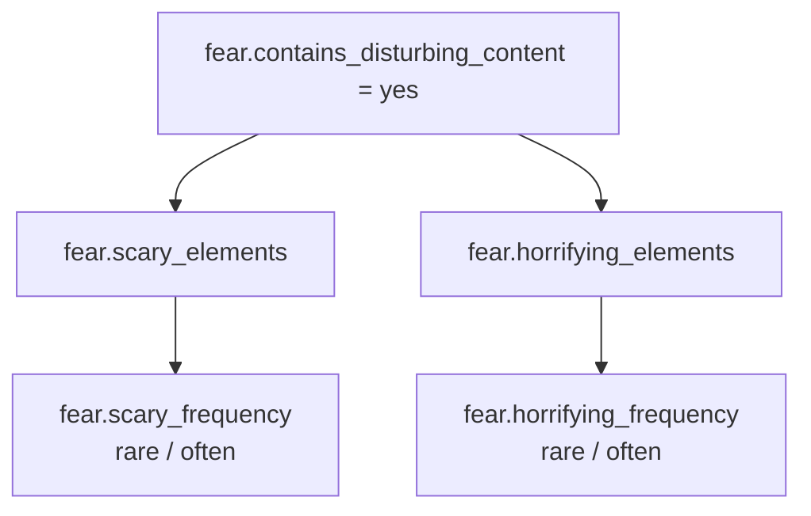
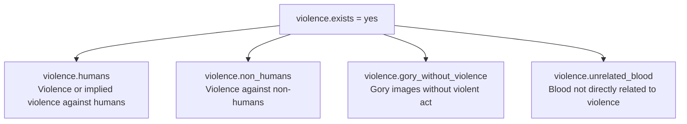
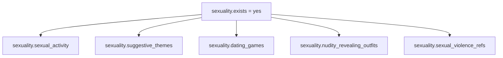
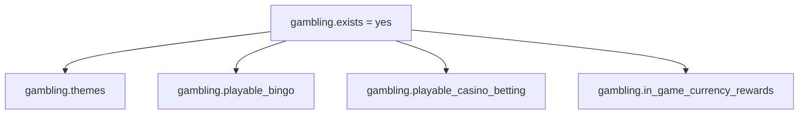
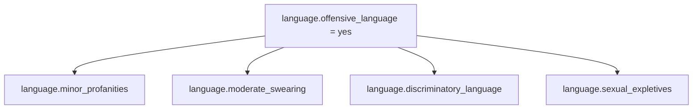
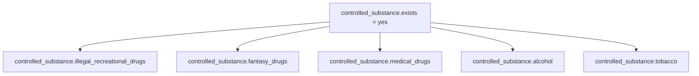

# Game 内容评级问卷地图

## 当前进度

你已经完成了 `Game` 分支的全 `No` 基线：

- 问卷截图：`screenshots/问卷全no.png`
- Summary 截图：`screenshots/全no对应评级.png`
- 基线记录：`docs/baseline_all_no.md`

这一步确认了当前可见的 14 个顶层问题。随后你又完成了 `Fear = Yes` 分支：
`Scary elements = Yes / Rare`、`Scary elements = Yes / Often`、`Horrifying elements = Yes / Rare`
和 `Horrifying elements = Yes / Often` 四个探针，记录见
`docs/probe_yes_fear.md`、`docs/probe_yes_fear_often.md` 和
`docs/probe_yes_fear_horrifying.md`。

此外，已用低频 `discover` 方式确认了 `Violence`、`Sexuality`、`Gambling`、
`Language`、`Controlled Substance` 的第一层子题。注意：这些分支目前只确认了
“打开 Yes 后会出现哪些第一层问题”，还没有系统跑完所有子题组合和 Summary 评级，
因此现在还不能开始批量随机采样。

2026-06-07 追加了一轮结构探针，记录见
`docs/structure_probe_20260607.md`。本轮将 `questionnaire_map.json` 从 53 个节点扩展到
120 个节点，新增了 Violence、Sexuality、Gambling、Language、Controlled Substance、
Crude Humor、Digital Purchases 和 Miscellaneous 下的多层条件题。当前地图结构校验通过，
但仍保留 54 个深层 leaf/选项节点为 `children_explored=false`，因此正式 1000 条放量采样
仍应暂停。

## 已确认的顶层问题

```mermaid
flowchart TD
    A["Game questionnaire"]
    A --> V["violence.exists<br/>Violence, Blood, or Gory Images"]
    A --> F["fear.contains_disturbing_content<br/>Fear"]
    A --> S["sexuality.exists<br/>Sexuality / Suggestiveness / Dating"]
    A --> G["gambling.exists<br/>Gambling themes / simulated / real gambling"]
    A --> L["language.offensive_language<br/>Language"]
    A --> C["controlled_substance.exists<br/>Controlled Substance"]
    A --> H["crude_humor.exists<br/>Crude Humor"]
    A --> D["digital_purchases.exists<br/>Digital Purchases / Rewards / NFTs"]
    A --> M1["misc.user_interaction<br/>User interaction / UGC-like exchange"]
    A --> M2["misc.precise_location<br/>Precise location sharing"]
    A --> M3["misc.germany_nazi_symbols<br/>Germany unconstitutional symbols"]
    A --> M4["misc.korea_national_identity<br/>Korea national identity"]
    A --> M5["misc.terrorism_advocacy<br/>Terrorism advocacy"]
    A --> M6["misc.realistic_crimes<br/>Realistic crimes / criminal techniques"]
```



## 已确认的 Fear 子树

当前控制台已经确认 `Fear = Yes` 后会出现：



`Scary elements = Yes` 与 `Horrifying elements = Yes` 的 `Rare` 和 `Often`
均已完成，当前未发现更深子题。

## 已确认的第一层子树

下面这些分支已通过 `discover` 低频侦察确认第一层结构，但尚未继续穷举更深子分支。

### Violence

证据文件：`results/discover_violence_yes_questionnaire.json`



其中 `violence.humans = yes` 已确认会出现更深子题，例如 setting/context、visual style、
reactions、presentation、blood/gore level、war setting、innocent characters、dark overtones。
这部分记录在 `results/discover_violence_humans_questionnaire.json`，但尚未完成评级探针。

### Sexuality

证据文件：`results/discover_sexuality_yes_questionnaire.json`



### Gambling

证据文件：`results/discover_gambling_yes_questionnaire.json`



### Language

证据文件：`results/discover_language_yes_questionnaire.json`



### Controlled Substance

证据文件：`results/discover_controlled_substance_yes_questionnaire.json`



## 下一轮操作：一次只开一个 Yes

从全 `No` 状态返回 Questionnaire 页面，按下面顺序探索。每一轮都只把一个顶层问题改成
`Yes`，其他顶层题保持 `No`。

| 轮次 | 改成 Yes 的顶层题 | 为什么先做 |
|---:|---|---|
| 1 | `fear.contains_disturbing_content` | 已完成：Fear 子树结构已确认 |
| 1a | `fear.scary_frequency = often` | 已完成：确认频率会让 Brazil、ESRB、GRAC、Gmedia、USK 等进一步升档 |
| 1b | `fear.horrifying_elements = yes` | 已完成：确认 Horrifying 更高风险，且有独立频率题 |
| 2 | `violence.exists` | 第一层已确认；human violence 会触发更深子题 |
| 3 | `sexuality.exists` | 第一层已确认：sexual activity、suggestive themes、dating、nudity、sexual violence |
| 4 | `gambling.exists` | 第一层已确认：gambling themes、bingo、casino/betting、in-game currency rewards |
| 5 | `language.offensive_language` | 第一层已确认：minor、moderate、discriminatory、sexual expletives |
| 6 | `controlled_substance.exists` | 第一层已确认：illegal/recreational、fantasy、medical、alcohol、tobacco |
| 7 | `crude_humor.exists` | 子树可能较短，适合补完 |
| 8 | `digital_purchases.exists` | 可能影响 interactive elements，而不一定影响年龄评级 |
| 9-14 | Miscellaneous 六题 | 多数可能是独立题，但要验证是否出现额外说明或结果变化 |

每一轮记录：

1. 该顶层题改 `Yes` 后是否出现子问题。
2. 子问题原文、选项、父条件和截图。
3. 走到 Summary 后的全部地区评级。
4. 是否出现 reCAPTCHA、限速或页面异常。

## 文件命名建议

截图使用稳定命名，后续整理时不会乱：

```text
screenshots/yes_fear_questionnaire.png
screenshots/yes_fear_summary.png
screenshots/yes_violence_questionnaire.png
screenshots/yes_violence_summary.png
```

对应结果说明可放到：

```text
docs/probe_yes_fear.md
docs/probe_yes_violence.md
```

## 节点记录格式

```json
{
  "question_id": "fear.scary_frequency",
  "section": "Fear",
  "prompt": "How frequent are the scary elements?",
  "type": "single_choice",
  "options": ["rare", "often"],
  "visible_when": {
    "parent_id": "fear.scary_elements",
    "equals": "yes"
  },
  "children": [],
  "children_explored": true,
  "verified_in_console": true,
  "screenshot": "screenshots/yes_fear_questionnaire.png"
}
```

## 验收标准

- 全 `No` 能稳定回到 `docs/baseline_all_no.md` 中的评级。
- 每个顶层题都至少完成一次“只有它为 Yes”的探针。
- 所有新增子题都写入 `questionnaire_map.json`。
- 隐藏子题保持 `N/A`，不要写成 `No`。
- 不点击最终 `Submit`。
