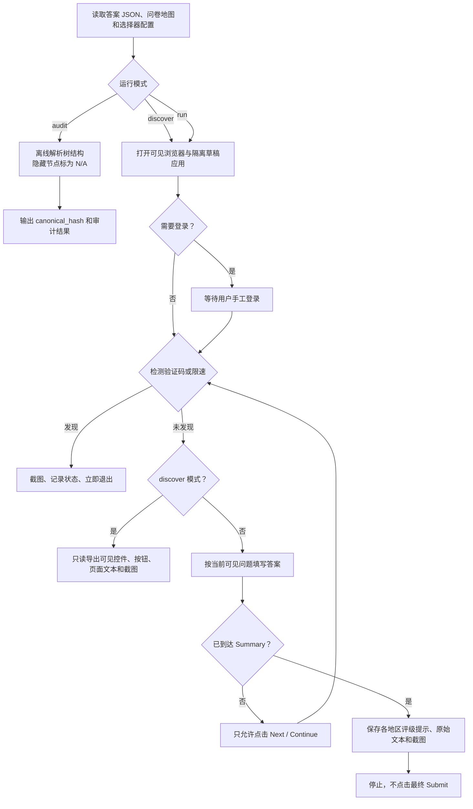

# 单次采集脚本流程

## 核心原则

`fill_once.py` 用于隔离草稿应用中的单次采集。脚本保留可见浏览器和持久化登录目录，
到达 Summary 后立即停止，不点击最终提交、发布或送审按钮。

## 流程图

## 运行状态

| 状态 | 含义 | 后续动作 |
|---|---|---|
| `ok` | 离线审计或只读侦察成功 | 继续人工校准 |
| `summary_reached` | 已读取 Summary 且未最终提交 | 与手工结果交叉验证 |
| `captcha_detected` | 检测到验证码 | 停止并补充侦察记录 |
| `rate_limited` | 检测到限速 | 停止，等待并降低频率 |
| `login_timeout` | 手工登录超时 | 检查账号和页面 URL |
| `structure_changed` | 页面与地图或选择器不匹配 | 用 `discover` 重新侦察 |

## 校准要点

- 真实控制台的文案、DOM 和 Summary 结构可能变化。
- `selectors.json` 只提供保守的起始标记。
- 首次正式采集前必须完成全 No、全 Yes 和随机路径的手工与脚本比对。
- `summary.raw_text` 在解析器稳定前是可信来源，自动提取的 `rating_hint` 仅供校准。
